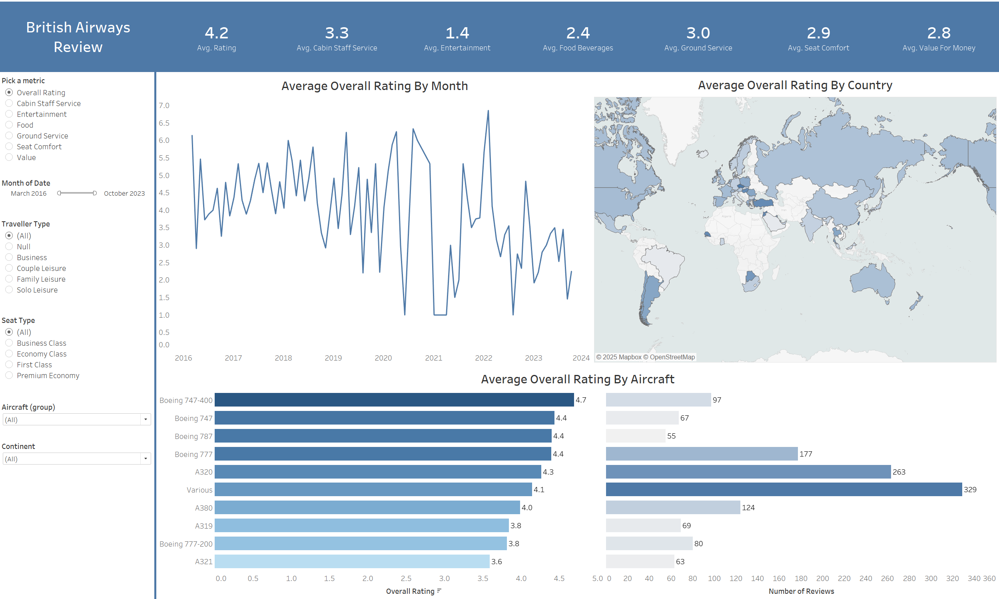

# ✈️ British Airways Review Dashboard (Tableau)

## 📌 Project Overview
This project is an **interactive Tableau Dashboard** designed to analyze and visualize **British Airways (BA) customer reviews** across multiple dimensions such as **country, rating, seat comfort, and overall experience**. The goal is to identify patterns in customer satisfaction and provide insights into factors that impact the airline’s performance.

The dashboard enables users to **filter by country, cabin type, and rating**, allowing for dynamic analysis and decision-making. This project is part of my **Tableau portfolio** to showcase advanced data visualization and storytelling skills.

The dataset and concept for this project were inspired by **[Mo Chen's Tableau Portfolio Project](https://www.youtube.com/watch?v=KlAKAarfLRQ)**.  
This dashboard was built by me from scratch following the tutorial and adding my own enhancements for visualization and interactivity.

---

## ✅ Objectives
- Analyze **customer reviews** from multiple countries.
- Identify **patterns in airline satisfaction ratings**.
- Compare **different service categories** such as:
  - Seat comfort
  - Food & beverages
  - Cabin staff service
  - Entertainment
- Build an **interactive, visually appealing dashboard** for stakeholders.

---

## 🛠️ Tools & Technologies
- **Tableau Desktop** – For creating the interactive dashboard.
- **CSV Files (countries.csv & ba_reviews.csv)** – For storing and processing raw data.
- **Excel** – For any preprocessing or data cleaning.
- **GitHub** – For project version control and sharing.

---

## 📊 Dashboard Features
- **KPIs Displayed**:
  - Average Rating
  - Total Reviews
  - Country-wise Review Counts
- **Visual Components**:
  - **Bar Charts**: Country vs Average Rating
  - **Pie Charts**: Rating distribution
  - **Tables**: Breakdown of review attributes
- **Filters**:
  - By **Country**
  - By **Cabin Type**
  - By **Overall Rating**

---

## 📈 Insights from the Analysis
- Certain countries consistently provide **higher ratings** compared to others.
- **Cabin staff service** has the most influence on overall ratings.
- **Economy class passengers** tend to give lower ratings compared to Business/First Class.
- Seasonal spikes in review volume suggest trends during **peak travel months**.

---

## 📸 Dashboard Preview

---

## 📥 Dataset Details

ba_reviews.csv – Contains British Airways customer reviews with columns like:

Date, Country, Rating, Seat Comfort, Cabin Staff Service, Food & Beverage, Entertainment, Overall Experience

countries.csv – Contains country codes and mapping data for geographic analysis.

---

## ✅ Key Skills Demonstrated

Data Cleaning & Preparation

Interactive Dashboard Design in Tableau

Data Visualization & Storytelling

GitHub Project Documentation

---

## 🙌 Credits

Original idea and dataset source: Mo Chen - Tableau Portfolio Project Video

Dashboard design and implementation: Tafhim Khan

---

## ✨ Author

Tafhim Khan 
